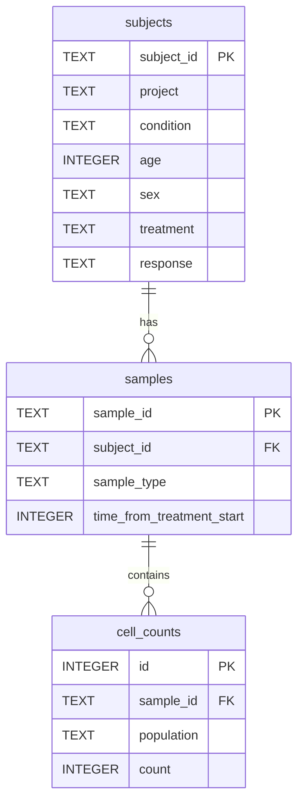

# Teiko Technical — Immune Cell Count Analysis

Clinical trial analysis tool for exploring immune cell population data from patient samples.

## Quick Start (GitHub Codespaces)

```bash
make setup       # install dependencies
make pipeline    # load data + generate all outputs (Parts 1-4)
make dashboard   # launch Streamlit dashboard at http://localhost:8501
```

Requirements: Python >= 3.10

## Dashboard

After running `make dashboard`, open:

**http://localhost:8501**

The dashboard has three tabs covering Parts 2–4: population frequencies, response analysis (boxplots + statistics), and baseline subset summaries.

---

## Project Structure

```
Teiko_Technical/
├── cell-count.csv              # source data
├── cell-count.db               # SQLite database (generated by pipeline)
├── load_data.py                # Part 1: database loading
├── run_pipeline.py             # orchestrates Parts 1-4, writes output/
├── makefile                    # setup, pipeline, dashboard targets
├── requirements.txt
├── dashboard/
│   └── app.py                  # Streamlit interactive dashboard
├── output/                     # generated tables and plots
└── src/
    ├── db/schema.py            # SQLite schema definition
    └── analysis/
        ├── overview.py         # Part 2: population frequencies
        └── stats_analysis.py   # Part 3 & 4: statistical + subset analysis
```

### Design Rationale

- **`load_data.py` at repo root** — assignment requires `python load_data.py` with no CLI args; kept as the Part 1 entry point, with reusable `build_database()` for the pipeline.
- **`src/analysis/` modules** — separate data loading (Part 1), overview (Part 2), and downstream analysis (Parts 3–4) so each part can be tested and imported independently.
- **`run_pipeline.py`** — single orchestrator for automated grading via `make pipeline`; writes all CSV/PNG outputs to `output/` without manual steps.
- **Streamlit dashboard** — read-only visualization layer on top of the same analysis functions; no duplicated logic.
- **SQLite** — zero-config, file-based, sufficient for this dataset; schema is normalized for flexible SQL queries.

---

## Database Schema

### ER Diagram



### Design Rationale

The CSV stores one row per sample with five wide-format cell count columns. The schema normalizes this into three tables:

| Table | Role |
|-------|------|
| `subjects` | Patient-level metadata (response, treatment) — one row per subject |
| `samples` | Sample-level metadata (type, time point) — one row per biological sample |
| `cell_counts` | Long-format counts — one row per sample × population |

**Why long format for `cell_counts`?** Parts 2–4 compare populations across samples. Long format avoids repeated column names, simplifies SQL aggregation, and maps directly to the Part 2 summary table (`sample`, `population`, `count`, `percentage`).

**Why separate `subjects` and `samples`?** A subject can have multiple samples (e.g. day 0, 7, 14). Response and treatment belong to the patient; sample type and time belong to the sample. This avoids duplicating subject metadata on every sample row.

### Scalability

For hundreds of projects and thousands of samples:

- **Indexes** on `(condition, treatment)`, `(sample_type, time_from_treatment_start)`, and foreign keys keep filter queries fast as data grows.
- **Long-format `cell_counts`** with `UNIQUE (sample_id, population)` supports efficient per-population analytics without schema changes when new cell types are added.
- **SQLite → PostgreSQL** migration is straightforward: same relational schema, swap the connection layer.
- **Materialized views** (e.g. pre-computed population frequencies) can be added for heavy dashboards without changing the base schema.
- **Partitioning by project** in `subjects.project` allows project-scoped queries without full table scans.

---

## Parts 1–4

### Part 1: Data Management

Loads `cell-count.csv` into `cell-count.db` via `load_data.py` / `build_database()`.

| Table | Rows |
|-------|------|
| subjects | 3,500 |
| samples | 10,500 |
| cell_counts | 52,500 |

### Part 2: Population Frequencies

Relative frequency (%) of each cell population per sample. Output: `output/population_frequencies.csv`

### Part 3: Response Analysis

Compares melanoma + miraclib + PBMC responders vs non-responders. Mann-Whitney U test per population.

Outputs:
- `output/response_analysis_data.csv`
- `output/response_comparison.csv`
- `output/response_boxplots.png`

### Part 4: Baseline Subset Analysis

Filter: melanoma + miraclib + PBMC + `time_from_treatment_start = 0`

Outputs:
- `output/subset_samples_by_project.csv`
- `output/subset_subjects_by_response.csv`
- `output/subset_subjects_by_sex.csv`

---

## Makefile Commands

| Command | Description |
|---------|-------------|
| `make setup` | Install Python dependencies from `requirements.txt` |
| `make pipeline` | Run full pipeline: init DB, load data, generate all output tables and plots |
| `make dashboard` | Start Streamlit dashboard at http://localhost:8501 |

---

## Output Files

After `make pipeline`, the `output/` directory contains:

| File | Part | Description |
|------|------|-------------|
| `population_frequencies.csv` | 2 | Sample × population relative frequencies |
| `response_analysis_data.csv` | 3 | Filtered data for response comparison |
| `response_comparison.csv` | 3 | Mann-Whitney U test results |
| `response_boxplots.png` | 3 | Boxplots by population (yes vs no) |
| `subset_samples_by_project.csv` | 4 | Sample counts per project |
| `subset_subjects_by_response.csv` | 4 | Subject counts by response |
| `subset_subjects_by_sex.csv` | 4 | Subject counts by sex |
