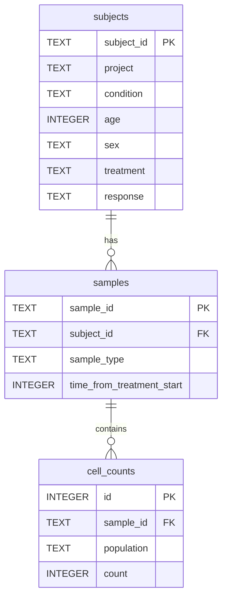

# Teiko Technical — Immune Cell Count Analysis

Clinical trial analysis tool for exploring immune cell population data from patient samples.

## Quick Start

```bash
make install    # install dependencies
make load       # load cell-count.csv into cell-count.db
make dashboard  # launch Streamlit dashboard
```

Requirements: Python >= 3.10

---

## Project Structure

```
Teiko_Technical/
├── cell-count.csv          # source data
├── cell-count.db           # SQLite database (generated)
├── load_data.py            # Part 1: data loading
├── makefile
├── dashboard/
│   └── app.py              # interactive dashboard
└── src/
    ├── db/schema.py        # database schema
    └── analysis/
        ├── overview.py     # Part 2
        └── stats_analysis.py  # Part 3
```

---

## Part 1: Data Management

Load `cell-count.csv` into a normalized SQLite database (`cell-count.db`).

```bash
make load
# or: python load_data.py
```

### Schema



| Table | Description |
|-------|-------------|
| `subjects` | Patient metadata (one row per subject) |
| `samples` | Sample metadata (one row per sample) |
| `cell_counts` | Long-format counts per sample × population |

Five populations: `b_cell`, `cd8_t_cell`, `cd4_t_cell`, `nk_cell`, `monocyte`. CSV wide-format columns are unpivoted via `pandas.melt()` on load.

| Table | Rows |
|-------|------|
| subjects | 3,500 |
| samples | 10,500 |
| cell_counts | 52,500 |

---

## Part 2: Initial Analysis — Data Overview

**Question:** What is the frequency of each cell type in each sample?

For each sample, compute total cell count and the relative frequency (%) of each population. Output columns: `sample`, `total_count`, `population`, `count`, `percentage`.

- **Script:** `src/analysis/overview.py` → `get_population_frequency()`
- **Dashboard:** "Part 2: Population Frequencies" tab

---

## Part 3: Statistical Analysis

Compare relative frequencies between **responders** (`response = yes`) and **non-responders** (`response = no`) for:

- `condition = melanoma`
- `treatment = miraclib`
- `sample_type = PBMC`

- **Script:** `src/analysis/stats_analysis.py`
  - `get_miraclib_melanoma_pbmc()` — filter and join with Part 2 summary
  - `plot_response_boxplots()` — boxplot per population (yes vs no)
  - `compare_response_groups()` — Mann-Whitney U test (p < 0.05)
- **Dashboard:** "Part 3: Response Analysis" tab

---

## Part 4: Data Subset Analysis

Explore baseline samples to understand early treatment effects.

**Filter:** melanoma + miraclib + PBMC + `time_from_treatment_start = 0`

Report:

- Sample count per project
- Subject count by response (yes / no)
- Subject count by sex (M / F)

- **Script:** `src/analysis/stats_analysis.py` → `data_subset_analysis()`
- **Dashboard:** "Part 4: Data Subset Analysis" tab

---

## Makefile Commands

| Command | Description |
|---------|-------------|
| `make install` | Install Python dependencies |
| `make load` | Build `cell-count.db` from CSV |
| `make dashboard` | Run Streamlit app |
